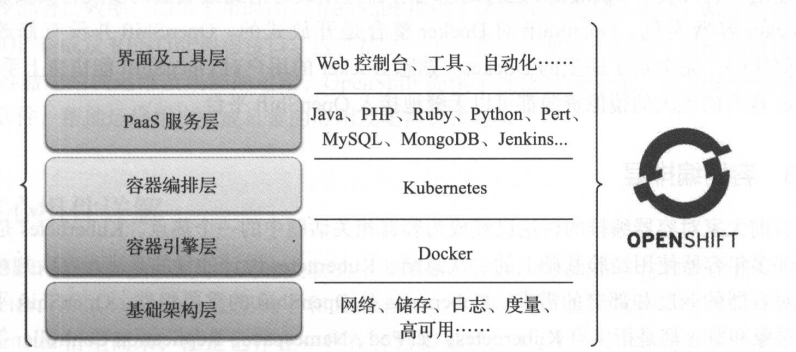
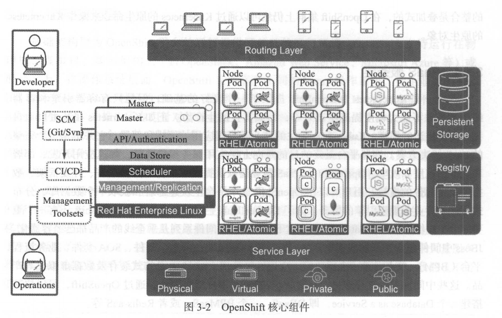

# 1.架构概述

​		从技术堆栈的角度分析，作为容器云，OpenShift自底而上包含了以下几个层次：基础架构层、容器引擎层、容器编排层、PaaS服务层、界面及工具层，如图所示。




## 1.1.基础架构层

​		基础架构层为OpenShift平台的运行提供了基础的运行环境。OpenShift支持运行在物理机、虚拟机、基础架构云(如OpenStack、Amazon Web Service等)或混合云上。在操作系统层面，OpenShift支持多种不同的Linux操作系统，如企业级的Red Hat Enterprise Linux、社区的CentOS。值得一提的是，2015年Red Hat针对容器平台启动了Atomic Project，并推出了专门针对容器化运行环境的操作系统Atomic Host。从技术上来看，Atomic Host也是一个Linux操作系统，是基于Red Hat的企业版Linux的基础上优化和定制而来的。通过根分区只读、双根分区、RPM OSTree等特性，Atomic Host可以为容器应用的运行提供一个高度一致的环境，保证在大规模容器集群环境中容器应用的稳定与安全。

保证应用的一致性是容器的优点。在开发、测试和生产环境中运行的结果应该是一致的。但是容器的一致性和可移植性是有前提条件的，那就底层操作系统的内核及相关配置要一致。容器为应用提供了一个隔离的运行环境，这个隔离的实现依赖于底层Linux内核的系统调用。如果大量服务器的Linux内核及操作系统的配置不能保证一致，那么容器运行的最终结果的一致性也不可能有保障。

## 1.2.容器引擎层

OpenShift目前以Docker作为平台的容器引擎。Docker是当前主流的容器引擎，已经在社区及许多企业的环境中进行了检验。事实证明Docker有能力为应用提供安全、稳定及高性能的运行环境。OpenShift运行的所有容器应用最终落到最底层的实现，其实就是一个Docker容器实例。OpenShift对Docker整合是开放式的。OpenShift并没有修改Docker的任何代码，完全基于原生的Docker。熟悉Docker的用户对OpenShift能快速上手。同时，Docker现有的庞大的镜像资源都可以无缝地接入OpenShift平台。

## 1.3.容器编排层

Kubernetes是Google在内部容器多年使用经验基础上的一次总结。Kubernetes设计的目的是满足在大规模集群环境下对容器的调度和部署的需求。Kubernetes是OpenShift的重要组件，OpenShift平台上的许多对象和概念都是衍生自Kubernetes，如Pod、Namespace、Replication Controller等。与对Docker的集成一样，OpenShift并没有尝试从代码上定制Kubernetes，OpenShift对Kubernetes的整合是叠加式的，在OpenShift集群上仍然可以通过Kubernetes的原生命令来操作Kubernetes的原生对象。

## 1.4.PaaS服务层

容器平台最终的目的是向上层应用服务提供支持，加速应用开发、部署和运维的速度和效率。OpenShift在PaaS服务层默认提供了丰富的开发语言、开发框架、数据库及中间件的支持。用户可以在OpenShift平台上快速部署和获取一个数据库、分布式缓存或者业务规则引擎的服务。除了Docker Hub上的社区镜像外，OpenShift还有一个重要的服务提供方：Red Hat。Red Hat旗下的JBoss中间件系列几乎全线的产品都已经容器化。通过OpenShift，可以快速搭建一个Database as a Service，即DBaaS，一个BPMAAS，或者Redis-aaS。

## 1.5.界面及工具层

云平台一个很重要的特点是强调用户的自助服务，从而降低运维成本，提高服务效率。界面和工具是容器云平台上的最后一公里接入，好的界面和工具集合能帮助用户更高效地完成相关业务。OpenShift提供了自动化流程Source to Image，即S2I，帮助用户容器化用各种编程语言开发的应用源代码。用户可以直接使用S2I或者把现有的流程与S2I整合，从而实现开发流程的持续集成和持续交付。提升开发、测试和部署的自动化程度，最终提高开发、测试和部署的效率。OpenShift提供了多种用户接入的渠道：Web控制台、命令行、IDE集成及RESTful编程接口。

针对容器应用的运维及集群的运维，OpenShift提供了性能度量采集、日志聚合模块及运维管理套件，帮助运维用户完成日常的应用及集群运维任务。

# 2.核心组件

OpenShift的核心组件及其之间的关联关系如下如所示。



OpenShift在容器编排层使用了Kubernetes，所以OpenShift在架构上和Kubernetes十分接近。其内部的许多组件和概念是从Kubernetes衍生而来的，但也有OpenShift特有的组件和概念。

## 2.1.Master节点

OpenShift集群可以由一台或多台主机组成。这些主机可以是物理机或虚拟机，同时可以运行在私有云、公有云，或者混合云上。在OepnShift集群的成员有2种角色。

- Master节点

即主控节点。集群内的管理组件均运行于Master节点之上。Master节点负责管理和维护OpenShift集群的状态。

- Node节点

即计算节点。集群内的容器实例均运行于Node节点之上。

如上图所示 在Master节点上运行了众多集群的服务组件：

- API Server

负责提供集群的Web Console以及RESTFul API服务。集群内的所有Node节点都会访问API Server更新各节点的状态及其上运行的容器的状态。

- 数据源(Data Store)

集群所有动态的状态信息都会崔存储在后端的一个etcd分布式数据库中。默认的etcd实例安装在Master节点上。如有需要，也可以将etcd节点部署在集群之外。

- 调度控制器(Scheduler)

调度控制器在容器部署时负责按照用户输入的要求寻找合适的计算节点。用户可以指定端口、CPU、内存及标签匹配等多种调度条件。

- 复制控制器(Replication Controller)

对容器云而言，一个很重要的特性是异常自恢复。复制控制器负责监控当前容器实例的数量和用户部署指定的容器数量是否匹配。如果容器异常退出，复制控制器将会发现实际的容器实例数少于部署定义的数量，从而触发部署新的容器实例，已恢复原有的状态。

## 2.2.Node节点

Node节点主要职责就是接受Master节点的指令，运行和维护Docker容器，并没有安装像Master节点那么多的组件。Master节点本身也是一个Node节点，只是在一般的环境中将其运行容器的功能关闭。

通过执行oc get node命令可以查看系统中的所有节点(需要system:admin用户)。

## 2.3.Project和Namespace

在Kubernetes中使用命名空间的概念来分隔资源。在同一个命名空间中，某一个对象的名称在其分类中必须唯一，但是分布在不同命名空间中的对象则可以同名。OpenShift中继承了Kubernetes命名空间的概念，而且在其之上定义了Project对象的概念。每一个Project会和一个Namespace相关联，甚至可以简单地认为，Project就是Namespace。所以在OpenShift中进行操作时，首先要确认当前执行的上行文是哪一个Project。


通过oc project 可以切换到指定的项目。
通过oc projects显示已存在的项目。

## 2.4.Pod

在OpenShift上运行的容器会被一种叫做Pod的对象所“包裹”，用户不会直接看到Docker容器本身。从技术上来说，Pod其实也是一种特殊的容器。

执行oc get pod命令可以看到当前所在项目的Pod。

执行oc describe pod命令可以查看容器的详细信息，如Pod部署的Node节点名、所处的Project、IP地址等。

用户可以近似认为实际部署的容器会运行在Pod内部。一个Pod内部可以运行一个或多个容器，运行在一个Pod内的多个容器共享这个Pod的网络及存储资源。从这个层面上，可以将Pod理解为一个虚拟主机，在这个虚拟主机中，用户可以运行一个或多个容器。虽然一个Pod内可以有多个容器，但是在绝大多数情况下，一个Pod内部只运行一个容器实例。Pod其实也是一个容器，通过dockerps命令可以查看Pod的实例信息。

容器像盒子一样为应用提供一个独立的运行环境，但它并不是一个黑盒子。用户可以实时地查看容器的输出，也可以进入容器内部执行操作。

执行oc logs 命令，可以查看Pod的输出。
执行oc rsh 命令，可以进入容器内部调试。

## 2.5.Service

容器是一个非持久化的对象。所有对容器的更改在容器销毁后默认都会丢失。同一个docker镜像实例化形成容器后，会恢复到这个镜像定义的状态，并且获取一个新的IP地址。容器的这种特性在某些场景下非常难能可贵，但是每个新容器的IP地址在不断变化，这对应用来说不是一件好事。如果容器(后端容器)在重启后地址改变了，需要使用该容器的服务(前端容器)就要更改相应的地址，如果不修改相应的地址，就需要有一种机制使得应用(前端容器)总是能够连接到容器(后端容器)。

为了克服容器变化引起的连接信息的变化，Kubernets提供了一种叫做Service(服务)的组件。当部署某个应用时，我们会为该应用创建一个Service对象。Service对象会与该应用的一个或多个Pod关联。同时每个Service会被分配到一个IP地址，这个地址是相对恒定的。通过访问这个IP地址及相应的端口，请求就会被转发到对应的Pod的相应端口。这就意味着，无论后端的Pod实例的数量或地址如何变化，前端的应用只需要访问Service的IP地址，就能连接到正确的后端容器实例。Service起到了代理的作用，在相互依赖的容器之间实现了解耦。

Service对象是基于应用的，而一个项目下可以有多个应用，一个Pod一般对应一个应用。
执行oc get svc命令，可以获取当前项目下所有Service对象的列表。

```
[root@master ~]#  oc get svcNAME                    CLUSTER-IP      EXTERNAL-IP   PORT(S)    AGE
cakephp-mysql-example   172.30.122.51           8080/TCP   16h
mysql                   172.30.44.129           3306/TCP   16h
```


如果尝试ping一下Service的IP地址，结果是不会成功的。因为Service的IP地址是虚拟的IP地址，而这个地址只有集群内的节点和容器可以识别。

除了通过地址访问Service所指向的服务外，还可以通过域名访问某一个Service。监听在Master上的集群内置DNS服务器会负责解析这个DNS请求。Service域名的格式是..svc或者..svc.cluster.local(这个针对老版本)。

如果发现内部域名解析失败，可以在/etc/resolve.conf中添加一条指向本机的域名服务器记录。
nameserver 127.0.0.1

## 2.6.Router与Route

Service提供了一个通往后端Pod集群的稳定入口，但是Service的IP地址只是集群内部节点及容器可见。对于外部的应用或者用户来说，这个地址是不可达的。

那么外面的用户想要访问Service指向的服务该怎么办？

OpenShift提供了Router(路由器)来解决这个问题。

Router组件就是一个运行在容器内的Haproxy，是一个特殊定制的Haproxy。用户可以在其上创建一种叫做Route的对象，可以称作路由规则。一个Route会与一个Service相关联，并且绑定一个域名。Route规则会被Router加载。当用户通过指定域名访问应用时，域名会被解析并指向Router所在的计算节点上。Router获取这个请求，然后根据Route规则定义转发给与这个域名相对应的Service后端所关联的Pod容器实例。

注：Router负责将集群外的请求转发给集群内的容器。Service则负责把来自集群内部的请求转发到指定的容器中。一个是对外，一个是对内。

## 2.7.Persistent Storage

容器默认是非持久化的，所有的修改在容器销毁时都会丢失。但现实是传统的应用大多都是有状态的，因此要求某些容器内的数据必须持久化，容器云平台必须为容器提供持久化存储(persistent storage)。Docker本身提供了持久化卷挂载的能力。OpenShift除了支持Docker持久化的挂载方式外，还提供了一种持久化供给模型，即Persistent Volume(持久化卷，PV)及Persistent Volume Claim(持久化卷请求，PVC)模型。在PV和PVC模型中，集群管理员会创建大量大小不同和不同特性的PV。用户在部署应用时，现式声明对持久化的需求，创建PVC。用户在PVC中定义所需存储的大小、访问方式(只读或可读可写；独占或是共享)。OpenShift集群会自动寻找符合要求的PV和PVC自动对接。通过PV和PVC模型，OpenShift为用户提供了一种灵活的方式来消费存储资源。

OpenShift对持久化后端的支持比较广泛，除了NFS及iSCSI外，还支持如Ceph、GluterFS等分布式存储，以及Amazon WebService和Google Compute Engine的云硬盘。

## 2.8.Registry

OpenShift提供了一个内部的Docker镜像仓库(Registry)，该镜像仓库用于存放用户通过内置的Source to Image镜像构建流程所产生的镜像。Registry组件默认以容器的方式提供。

执行oc get pod -n default命令查看Registry容器状态。

```
[root@master ~]
NAME                      READY     STATUS    RESTARTS   AGE
docker-registry-1-2kxx2   1/1       Running   4          18h
router-1-zvm87            1/1       Running   4          18h
执行oc get svc -n default命令查看Registry容器对应的Service信息。

[root@master ~]#  oc get svc -n default
NAME              CLUSTER-IP     EXTERNAL-IP   PORT(S)                   AGE
docker-registry   172.30.89.21   <none>        5000/TCP                  18h
kubernetes        172.30.0.1     <none>        443/TCP,53/UDP,53/TCP     18h
router            172.30.10.51   <none>        80/TCP,443/TCP,1936/TCP   18h
```


每当S2I完成镜像构建，就会向内部的镜像仓库推送构建完成的镜像。

注：内部镜像仓库存放的只是S2I产生的镜像。其他镜像可以存放在集群外部的镜像仓库，如企业的镜像仓库或者社区的镜像仓库。只要保证OpenShift的节点可以访问到这些镜像所在的镜像仓库即可。

## 2.9.Source to Image

容器镜像中包含了应用及其所依赖的运行环境。可以从社区或者第三方厂商获取基础的操作系统或中间件的镜像。而这些外部获取的操作系统或者中间件并不包含企业内部开发和定制的应用。企业内部的开发人员必须自行基于外部的基础镜像构建包含企业自身开发的应用。这个镜像的构建过程是必须的，可以手工构建，或者使用工具实现自动化。

OpenShift提供的S2I流程，就是为了使企业内容器的构建变得标准化和自动化，从而提高了软件从开发到上线的效率。

一个典型的S2I流程包含以下几个步骤：

​	1)用户输入源代码仓库的地址；

​	2)用户选择S2I构建的基础镜像(又称为Builder镜像)。Builder镜像中包含了操作系统、编程语言、框架等应用所需的软件及配置。用户也可以根据自身的需求定制自己的Builder镜像，并发布到目录中供用户选用。

​	3)用户或系统触发S2I构建。OpenShift将实例化S2I构建执行器。

​	4)S2I构建执行器将从用户指定的代码仓库下载源代码。

​	5)S2I构建执行器实例化Builder镜像。代码将会被注入Builder镜像中。

​	6)Builder镜像将根据预定义的逻辑执行源代码的编译、构建并完成部署。

​	7)S2I构建执行器将完成操作的Builder镜像并生成新的Docker镜像。

​	8)S2I构建执行器将新的镜像推送到OpenShift内部的镜像仓库。

​	9)S2I构建执行器更新该次构建相关的Image Stream信息。

S2I构建完成后，根据用户定义的部署逻辑，OpenShift将把镜像实例化部署到集群中。除了接受源代码仓库作为地址输入外，S2I还接受Dockerfile以及二进制文件作为构建的输入。用户甚至可以完全自定义构建逻辑来满足特殊的需求。

## 2.10.开发及管理工具集

OpenShift提供了不同的工具集来给开发和运维的用户提供良好的体验，也为持续集成和打通DevOps流程提供便利。例如，OpenShift提供了Eclipse插件，开发工程师可以在Eclipse中完成应用及服务的创建和部署、远程调试、实时日志查询等功能。

# 3.核心流程详解

OpenShift容器云提供了众多基础设施和工具，承载了众多功能和特性，帮助用户通过这个平台提升企业IT效率和敏捷度。纵观OpenShift容器云项目，其中最重要的核心流程是将应用从静态源代码变成动态的应用服务的过程。前文介绍的OpenShift及Kubernetes的核心组件和概念都是为了支持和实现这个过程而引入的。

## 3.1.应用构建

​	1)部署应用。流程的开始是用户通过OpenShift的Web控制台或命令行oc new-app创建应用。根据用户提供的源代码仓库地址及Builder镜像，平台将生成构建配置(Build Config)、部署配置(Deployment Config)、Service及Route等对象。

​	2)触发构建。应用相关的对象创建完毕后，平台将触发一次S2I构建。

​	3)实例化构建。平台依据应用的Build Config实例化一次构建，生成一个Build对象。Build对象生成后，平台将执行具体的构建操作，包括下载源代码、实例化Builder镜像、执行编译和构建脚本。

​	4)生成镜像。构建成功后将生成一个可供部署的应用容器镜像。平台将把此镜像推送到内部的镜像仓库组件Registry中。

​	5)更新Image Stream。镜像推送至内部的仓库后，平台将创建或更新应用的Image Stream的镜像信息，使之指向最新的镜像。

## 3.2.应用部署

​	6)触发镜像部署。当Image Stream的镜像信息更新后，将触发平台部署S2I构建生成的镜像。

​	7)实例化镜像部署。Deployment Config对象记录了对象部署的定义，平台依据此配置实例化一次部署，生成一个Deploy对象跟踪当次部署的状态。

​	8)生成Replication Controller。平台部署将实例化一个Replication Controller，用以调度应用容器的部署。

​	9)部署容器。通过Replication Controller，OpenShift将Pod及应用容器部署到集群的计算节点中。

## 3.3.请求处理

​	10)用户访问。用户通过浏览器访问Route对象中定义的域名。

​	11)请求处理并返回。请求到Router组件后，Router根据Route定义的规则，找到请求所含域名相关联的Service的容器，并将请求转发给应用容器。容器实例除了请求后返回数据，还会通过Router将数据返回给调用的客户端。

3.4.应用更新
在应用更新时，平台将重复上述流程的1~9步。平台将用下载更新后的代码构建应用，生成新的镜像，并将镜像部署至集群中。值得注意的是，OpenShift支持滚动更新。在第9步时，平台将通过滚动更新的方式，保证应用在新老实例交替时服务不间断。
